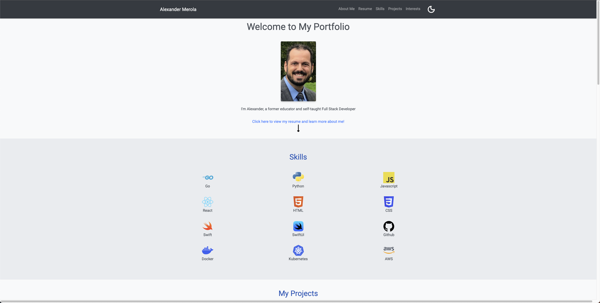

# Portfolio
My personal portfolio

 

  

  <h3 align="center">My Portfolio</h3>

  

    My portfolio of my personal projects
  

## Table Of Contents

* [About the Project](#about-the-project)
* [Authors](#authors)

## About The Project

The purpose of this portfolio is to showcase the personal projects created along my journey into full-stack development. I chose to use simple HTML, CSS and Javascript because using React or other frameworks seemed like overkill for what is a rather simple project. 
Designed with a focus on modern web technologies and best practices, this portfolio stands as a testament to my dedication, learning, and the hands-on skills I've acquired in software development.

## Author

* **Alexander Merola** - *Self-Taught Full Stack Developer* - [Alexander Merola](https://github.com/PlatosCodes/) - **
